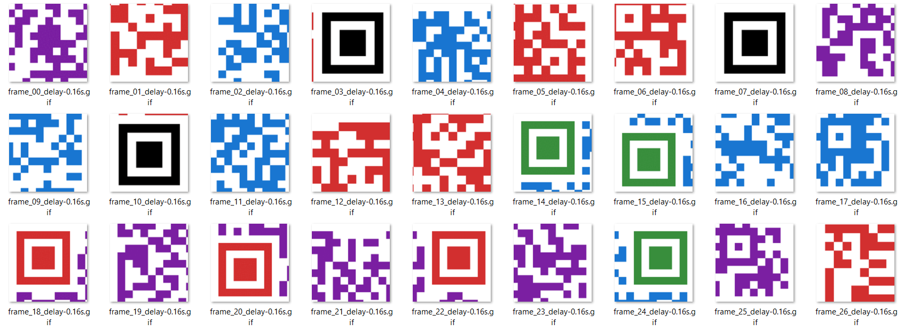

# Misc Puzzles

We’re given a gif, in which pieces of a QR code flash by very quickly. 
Using a tool, I broke down the gif into separate images and got the whole sequence into images.

It’s a jigsaw puzzle basically. I reorganized the QR codes, it is very easy since they’re all color coded and 9 pieces per QR code. 

The flag’s text was broken into three pieces:

grodno{In_t0day's_dig1tal_4ge,_QR_code5_h4ve_ev0lved_1nto_us3ful_tools for_pe0ple,_compan13s,_and_organ1zat10ns}
