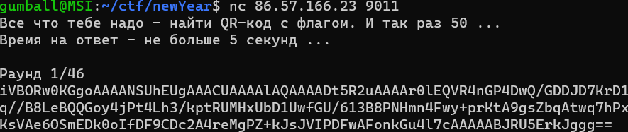
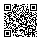

# NC QRCode

When we connect to the host, we see that we receive a string. 

This is base64, and it is actually an image (iVBOR is base64 header for PNG). Just testing it out converting that base64 string to Image, we get a sample QR Code like this:



So we need to decode 40+ QR Codes with automation so my process was

Base64 -> Image -> Resize image with PIL -> Decode QR code img with pyzbar

Decoding the QR code gave us a randomly generated text, which we need to reply with. Forty+ correct replies will get us the flag! Just let the script run quickly and we can get it :)
```
from time import sleep
import socket
from pyzbar.pyzbar import decode
from PIL import Image
import base64

sock = socket.socket()
sock.connect(("86.57.166.23", 9011))

def decoder(code):
	imageData = (code[code.index("iVBOR"):].strip())

	decodedData = base64.b64decode((imageData))
	imgFile = open("qr.png","wb")
	imgFile.write(decodedData)
	imgFile.close()

	im = Image.open("qr.png") #decode QR image
	newsize = (500,500)
	im1 = im.resize(newsize) #resizing image is important so it can be decoded by pyzbar
	text = decode(im1)[0].data.decode('ascii').strip()
	return text

while True:
	sleep(1)
	data = sock.recv(1024).decode('utf-8')
	if "grodno{" in data: #check for flag
		print(data)
		break
	else:
		reply = decoder(data)
		print (reply)
		sock.send((str(reply) + '\r\n').encode())
sock.close()
```
Flag was grodno{c183f0_d3c0d3_&_fr0m_&_QR_cf9805}
